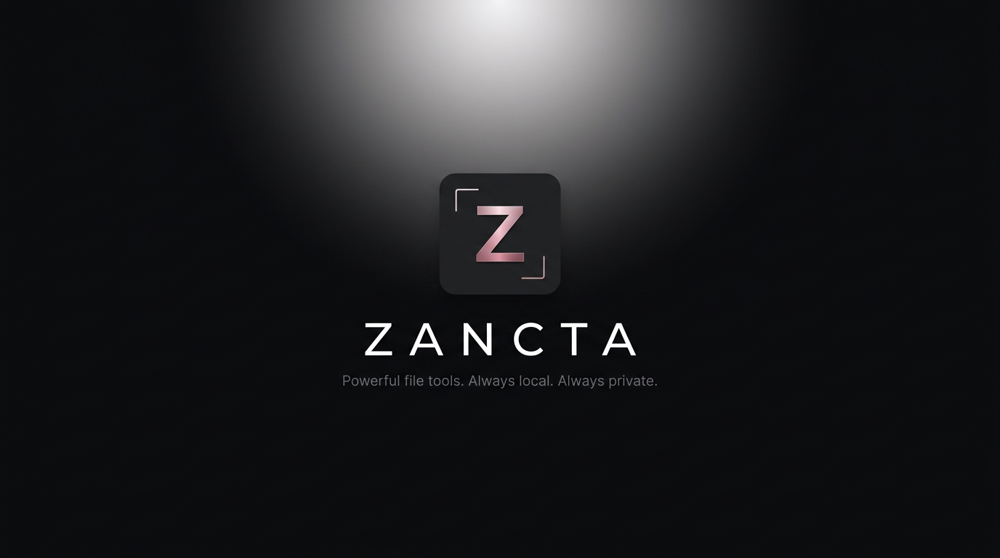
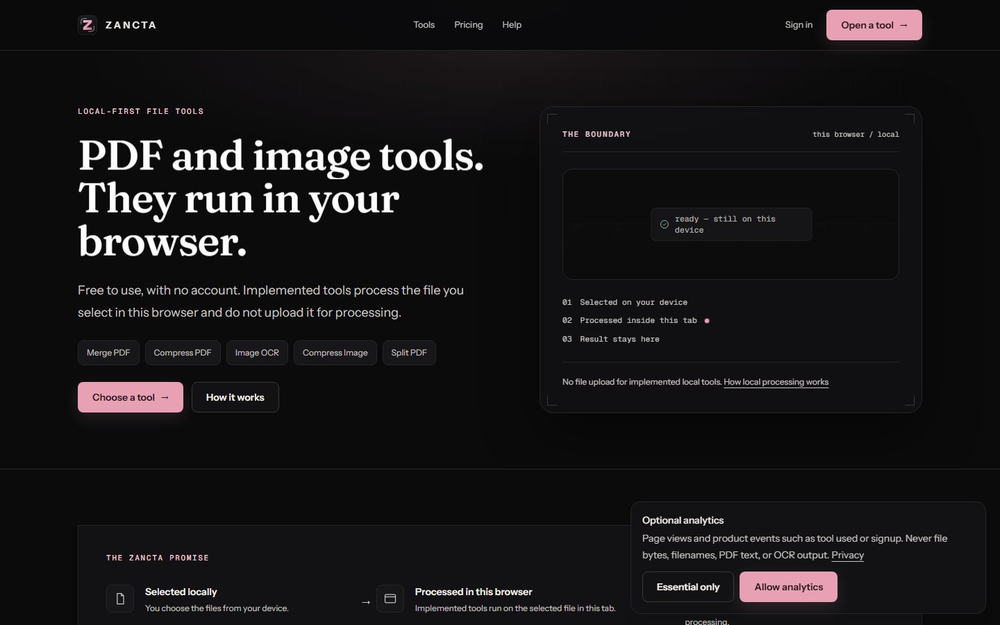
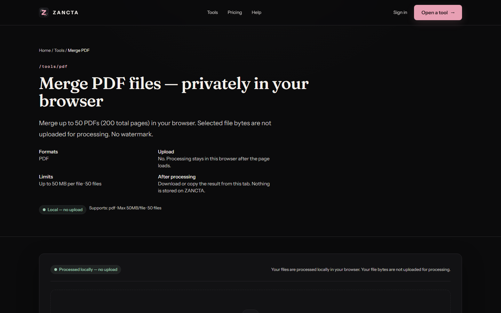

<p align="center">
  
</p>

<h1 align="center">ZANCTA</h1>

<p align="center"><strong>Privacy-first PDF and image tools that run in your browser.</strong></p>

<p align="center">
  <a href="https://zancta.tech">zancta.tech</a>
  ·
  <a href="docs/architecture/overview.md">Architecture</a>
  ·
  <a href="SECURITY.md">Security</a>
  ·
  <a href="LICENSE">License</a>
</p>

<p align="center">
  
</p>

ZANCTA is a local-first file suite. For implemented local workflows, selected file bytes stay in the tab: they are read with the browser File API and processed with pdf-lib, PDF.js, or Tesseract.js. ZANCTA does not post those bytes to a conversion API.

Free tools do not require an account. Limits, formats, and honest failure modes are documented on each tool page.

## Live website

**[https://zancta.tech](https://zancta.tech)**

<p align="center">
  
</p>

## Status

| Area | State |
|---|---|
| Eleven local PDF and image tools | **LIVE** |
| English image OCR in the browser | **LIVE** |
| Guides for local processing | **LIVE** |
| Accounts, email verification, OAuth | **LIVE** |
| Consent-gated GA4 | **LIVE** |
| Premium checkout (Dodo Payments) | **BUILT, NOT LIVE** — `GET /api/payments/checkout` returns `{"live":false}` |
| Display ads | **OFF** |
| Background removal | **PLANNED** — deferred until local model licensing is verified |
| Sentry error monitoring | **OPTIONAL** — inert unless a DSN is configured |

Do not treat IndexNow acceptance, crawl, or Search Console impressions as rankings.

## Tools

**LIVE** (local processing unless noted):

| Tool | What it does |
|---|---|
| [Merge PDF](https://zancta.tech/tools/pdf-merge) | Combine PDFs in the tab (up to 50 files / 200 pages) |
| [Split PDF](https://zancta.tech/tools/pdf-split) | Copy a page range into a new PDF |
| [Compress PDF](https://zancta.tech/tools/pdf-compress) | Rewrite with object streams — does **not** recompress embedded images |
| [PDF to Images](https://zancta.tech/tools/pdf-to-images) | Render pages to JPG, PNG, or WebP |
| [Images to PDF](https://zancta.tech/tools/images-to-pdf) | Build a PDF from images |
| [Compress Image](https://zancta.tech/tools/image-compress) | Reduce photographic size |
| [Convert Image](https://zancta.tech/tools/image-convert) | JPG ↔ PNG ↔ WebP |
| [Resize Image](https://zancta.tech/tools/image-resize) | Change pixel dimensions |
| [EXIF Cleaner](https://zancta.tech/tools/exif-cleaner) | Canvas re-encode; typical EXIF/GPS tags do not survive |
| [PDF Text Extractor](https://zancta.tech/tools/pdf-text-extractor) | Copy **embedded** PDF text (not OCR) |
| [Image OCR](https://zancta.tech/tools/ocr) | English OCR is free; extra languages and scanned-PDF OCR are Premium features |

<p align="center">
  
</p>

**PLANNED:** Background removal (`background-remover`) is registered but not available.

Exact formats and caps live in [`lib/tools.ts`](lib/tools.ts).

## Privacy architecture

```
Browser tab
  File API → pdf-lib / PDF.js / Tesseract.js worker
  Download result locally

Server (only when needed)
  Auth, accounts, entitlements
  Contact form, transactional email (Resend)
  Rate limiting (Upstash)
  Premium language-pack delivery (authenticated)
  Payments (Dodo) — checkout currently gated off
  Consent-gated analytics (GA4)
```

Local tools still download ordinary site assets (HTML, JS, fonts, OCR WASM). That is not the same as uploading a document to a conversion API. Browser extensions and the next site you share a file with remain outside ZANCTA’s boundary.

## Premium

Premium (Local OCR Power) is implemented in code: extra OCR languages and scanned-PDF OCR (20-page cap). **Checkout is not enabled in production.** The pricing page states that Premium is currently unavailable while launch configuration completes.

Merchant of record, when checkout is enabled: Dodo Payments.

## Technology

- Next.js 16 (App Router), React 19, TypeScript
- Prisma 7 + PostgreSQL
- Auth.js (credentials + optional Google/GitHub)
- pdf-lib, PDF.js, Tesseract.js, browser-image-compression
- Resend, Upstash Redis, Dodo Payments (gated)
- Vitest + Playwright

See [architecture](docs/architecture/overview.md).

## Security and accessibility

- HTTPS, CSP, HSTS in production, secure cookies on Vercel Production
- Rate limits on sensitive API routes
- No document bytes stored for local tool runs
- Playwright axe coverage for public pages; remaining visual issues are tracked in tests, not claimed as a certification

Report vulnerabilities per [SECURITY.md](SECURITY.md).

## Analytics

GA4 loads only after analytics consent. Measurement IDs are public by design. Tool events do not include file contents.

## Development

Prerequisites: Node 20+, npm 10+, Docker (for the test database).

```bash
npm install
cp .env.example .env   # fill secrets locally; never commit them
npx prisma generate
npm run dev
```

Environment inventory: [docs/operations/environment.md](docs/operations/environment.md).

```bash
npm run typecheck
npm run lint
npm test                          # starts local Postgres via docker compose
npm run build
npm run test:e2e -- --project=chromium
```

Deployment is Vercel Production for `https://zancta.tech`. See [docs/deployment/production.md](docs/deployment/production.md) and [docs/operations/vercel.md](docs/operations/vercel.md).

## Contributing and license

This repository’s application code is **proprietary**. See [LICENSE](LICENSE) and [CONTRIBUTING.md](CONTRIBUTING.md). Third-party packages and shipped OCR assets remain under their own licenses ([OCR license audit](docs/OCR_LICENSE_AUDIT.md)).

## Project status

ZANCTA is a live product at [zancta.tech](https://zancta.tech). Payments and ads are off. There is no published user count, revenue figure, or security certification.
